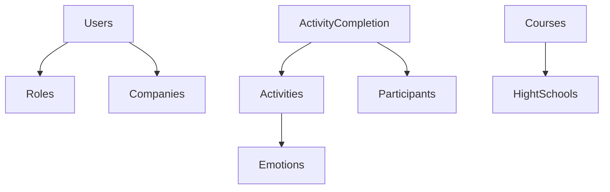

# Modelo de Base de Datos MongoDB

Este documento describe el esquema de base de datos MongoDB utilizado en la aplicación Vibra, organizado por categorías de dominio con descripciones detalladas de cada colección, sus campos, tipos de datos y relaciones.

> Documentación completa del schema migrada desde `model-schema-db.md`

## Colecciones por Categoría

- [Gestión de Usuarios](#gestión-de-usuarios)
- [Actividades y Aprendizaje](#actividades-y-aprendizaje)
- [Notificaciones](#notificaciones)
- [Permisos y Control de Acceso](#permisos-y-control-de-acceso)
- [Organizaciones](#organizaciones)
- [Configuración del Sistema](#configuración-del-sistema)
- [Auditoría y Reportes](#auditoría-y-reportes)
- [Almacenamiento de Archivos](#almacenamiento-de-archivos)

## Gestión de Usuarios

### Users

| Campo | Tipo | Descripción |
|-------|------|-------------|
| _id | ObjectId | Clave primaria |
| name | String | Nombre completo |
| email | String | Correo electrónico |
| username | String | Nombre de usuario |
| password | String | Contraseña encriptada |
| role | ObjectId | Referencia a Roles |
| company | ObjectId | Referencia a Companies |
| isActive | Boolean | Estado de la cuenta |
| deleted | Boolean | Eliminación suave |

**Relaciones:** Users → Roles (Muchos-a-Uno), Users → Companies (Muchos-a-Uno)

### Roles

| Campo | Tipo | Descripción |
|-------|------|-------------|
| _id | ObjectId | Clave primaria |
| serial | String | Identificador único |
| name | String | Nombre del rol |
| isSuperAdmin | Boolean | Acceso superadmin |
| isActive | Boolean | Estado del rol |

**Relaciones:** Roles → Users (Uno-a-Muchos)

## Actividades y Aprendizaje

### Activities

| Campo | Tipo | Descripción |
|-------|------|-------------|
| _id | ObjectId | Clave primaria |
| title | String | Título de la actividad |
| type | String | Tipo (reto, evento_personal, actividad_pares) |
| emotions | String | Emociones asociadas |
| difficulty | Int | Nivel de dificultad |
| isActive | Boolean | Estado de la actividad |
| games | Array | Configuraciones de juegos |

### Emotions

| Campo | Tipo | Descripción |
|-------|------|-------------|
| _id | ObjectId | Clave primaria |
| name | String | Nombre de la emoción |
| description | String | Descripción detallada |
| icono | String | Referencia al icono |

### ActivityCompletion

| Campo | Tipo | Descripción |
|-------|------|-------------|
| _id | ObjectId | Clave primaria |
| participantId | ObjectId | Referencia al participante |
| activityId | ObjectId | Referencia a la actividad |
| score | Int | Puntaje obtenido |
| date | DateTime | Fecha de finalización |

## Notificaciones

### Notifications

| Campo | Tipo | Descripción |
|-------|------|-------------|
| _id | ObjectId | Clave primaria |
| title | String | Título |
| message | String | Contenido |
| isRead | Boolean | Leída |
| priority | Int | Prioridad |

## Permisos y Control de Acceso

### Permissions

| Campo | Tipo | Descripción |
|-------|------|-------------|
| _id | ObjectId | Clave primaria |
| serial | String | Identificador único |
| name | String | Nombre del permiso |
| description | String | Descripción |
| permissionCategory | String | Categoría del permiso |

## Organizaciones

### Companies

| Campo | Tipo | Descripción |
|-------|------|-------------|
| _id | ObjectId | Clave primaria |
| name | String | Nombre de la empresa |
| nit | String | NIT |
| isActive | Boolean | Estado |

### Courses

| Campo | Tipo | Descripción |
|-------|------|-------------|
| _id | ObjectId | Clave primaria |
| name | String | Nombre del curso |
| hightSchool | String | Referencia a la institución |

## Diagrama de Relaciones



## Respaldo y Restauración

```bash
# Generar copia
mongodump --db vibra_db --out /path/to/backup

# Restaurar
mongorestore --db vibra_db /path/to/backup/vibra_db
```
